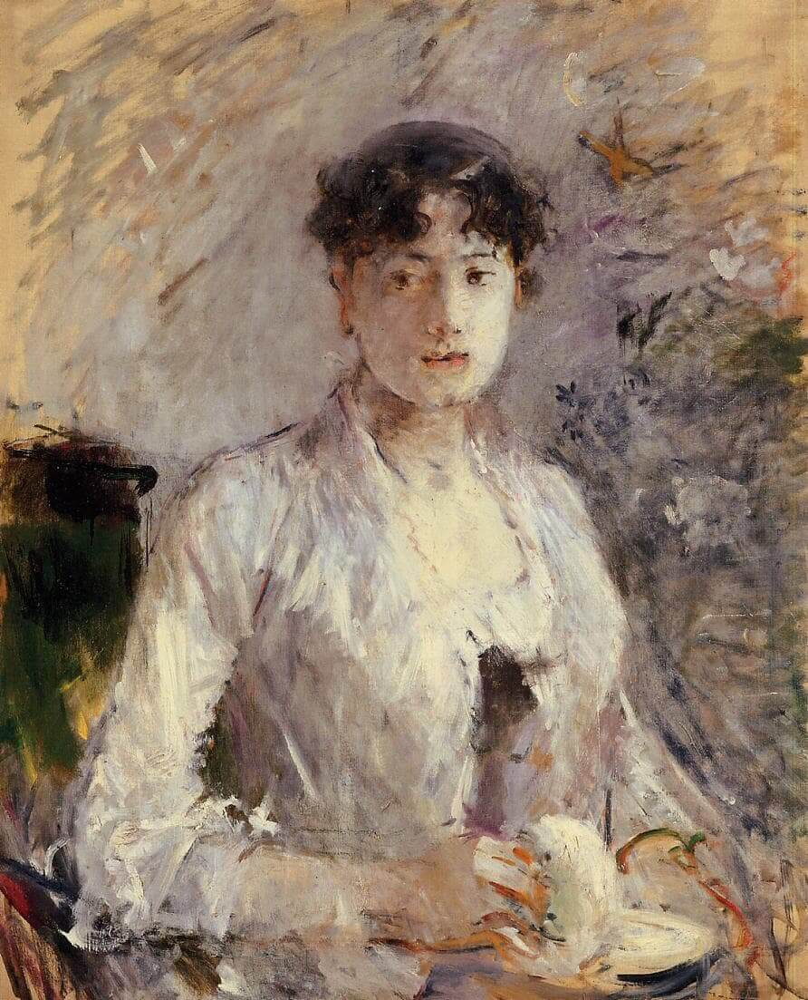

## Create your website with blocks

### Add block patterns

Block patterns are pre-designed groups of blocks. To add one, select the Add Block button \[+\] in the toolbar at the top of the editor. Switch to the Patterns tab underneath the search bar, and choose a pattern.

### Frame your images

Twenty Twenty-One includes stylish borders for your content. With an Image block selected, open the "Styles" panel within the Editor sidebar. Select the "Frame" block style to activate it.

### Overlap columns

Twenty Twenty-One also includes an overlap style for column blocks. With a Columns block selected, open the "Styles" panel within the Editor sidebar. Choose the "Overlap" block style to try it out.

Need help?

[Read the Theme Documentation](https://wordpress.org/support/article/twenty-twenty-one/)

[Check out the Support Forums](https://wordpress.org/support/theme/twentytwentyone/)
